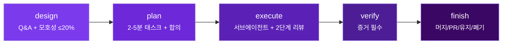
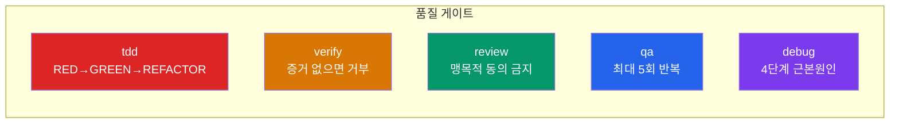
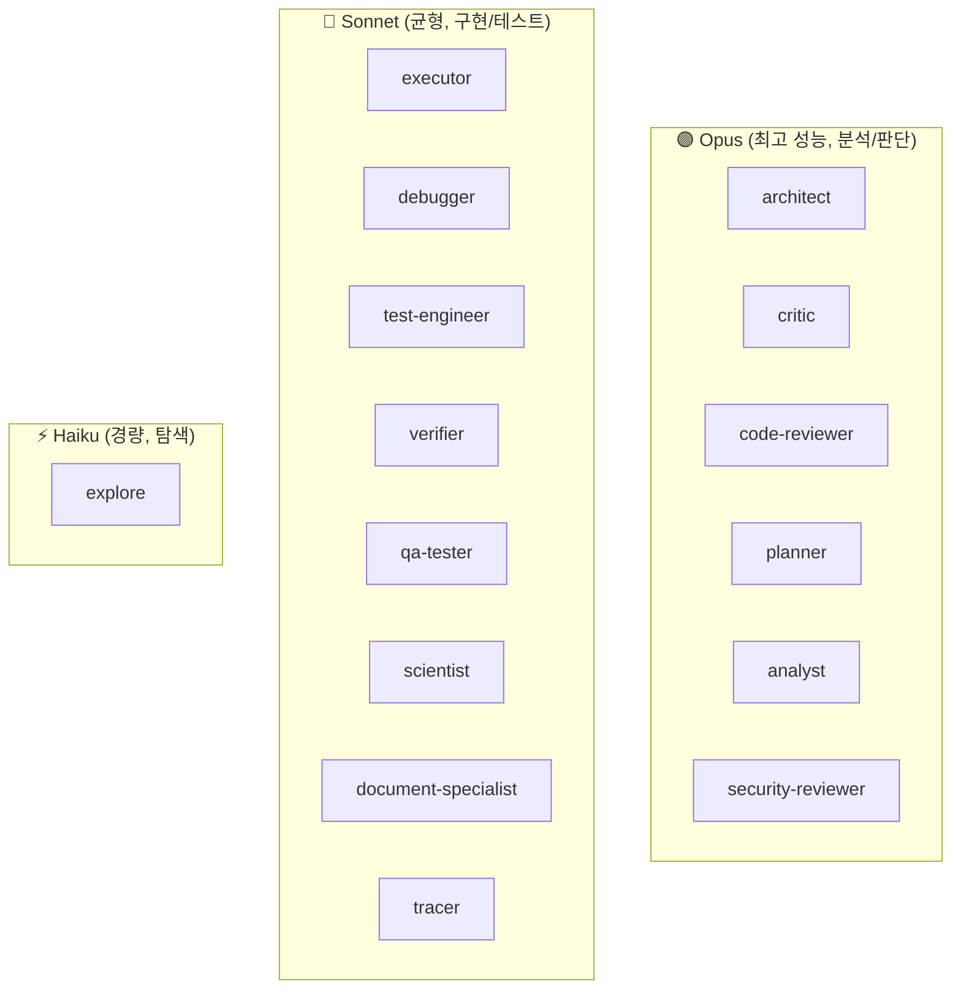
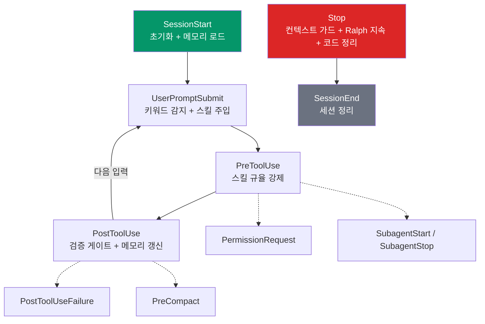
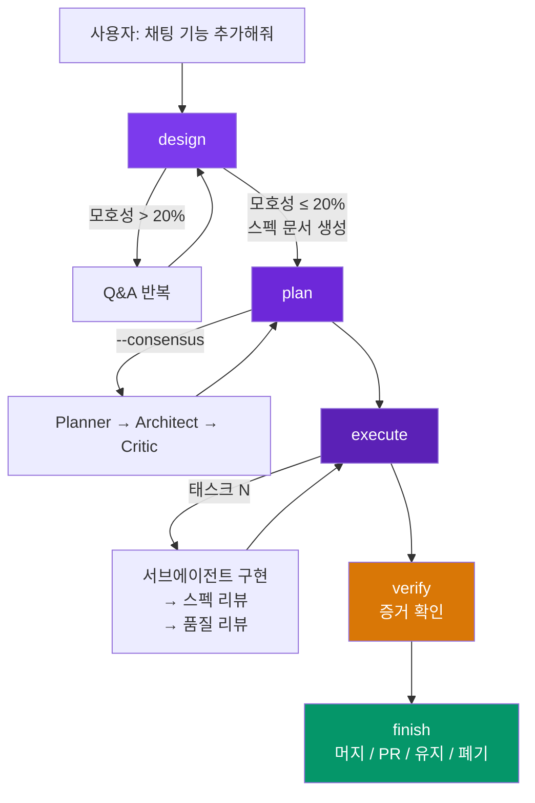
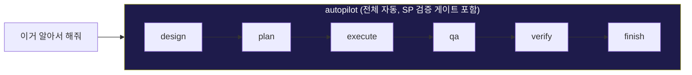

<p align="center">
  
  
  
</p>

<h1 align="center">sidep-ops</h1>

<p align="center">
  <strong>Superpowers의 개발 규율 + Oh-My-ClaudeCode의 오케스트레이션</strong><br/>
  3개 플러그인의 기능 겹침을 제거하고, 각각의 장점만 취합한 Claude Code 통합 플러그인
</p>

<p align="center">
  <a href="#-왜-만들었나">왜 만들었나</a> ·
  <a href="#-빠른-시작">빠른 시작</a> ·
  <a href="#-스킬-26개">스킬</a> ·
  <a href="#-에이전트-15개">에이전트</a> ·
  <a href="#-워크플로우">워크플로우</a> ·
  <a href="#-크레딧">크레딧</a>
</p>

---

## 🤔 왜 만들었나

**그냥 내가 쓰려고 만들었습니다.**

Claude Code 플러그인을 이것저것 깔다 보니 [Superpowers](https://github.com/obra/superpowers), [Oh-My-ClaudeCode](https://github.com/Yeachan-Heo/oh-my-claudecode), [Ralph Loop](https://github.com/claude-plugins-official/ralph-loop) 3개가 동시에 돌아가고 있었는데, `/context`를 찍어보니 비슷한 스킬이 이름만 다르게 수십 개 로드되어 있었습니다.

매 턴마다 컨텍스트를 잡아먹고, "이 작업은 `brainstorming`을 써야 하나 `deep-interview`를 써야 하나?" 같은 혼란이 반복되길래 — 그냥 하나로 합쳤습니다.

**겹치는 영역:**

| 도메인 | 이렇게 겹침 |
|--------|------------|
| 계획 | `brainstorming` ↔ `deep-interview` ↔ `omc-plan` ↔ `ralplan` |
| 실행 | `subagent-driven-dev` ↔ `ultrawork` ↔ `autopilot` ↔ `ralph` |
| 코드리뷰 | `requesting-code-review` ↔ `code-reviewer` agent ↔ `critic` agent |
| 검증 | `verification-before-completion` ↔ `verifier` agent ↔ `ultraqa` |
| 병렬작업 | `dispatching-parallel-agents` ↔ `ultrawork` ↔ `team` |

**sidep-ops**는 이 문제를 해결합니다:

| 항목 | 기존 (3개 플러그인) | sidep-ops | 절감 |
|------|-------------------|-----------|------|
| 스킬 | ~50개 | **26개** | -48% |
| 에이전트 | 20개 | **15개** | -25% |
| 플러그인 수 | 3개 | **1개** | -67% |
| 컨텍스트 소비 | ~3k 토큰/턴 | ~1.6k 토큰/턴 | **~45%** |

---

## 🚀 빠른 시작

### 설치

```bash
# 1. 마켓플레이스 등록
/plugin marketplace add https://github.com/atmigtnca/sidep-ops

# 2. 설치
/plugin install sidep-ops

# 3. 리로드
/reload-plugins
```

### 기존 플러그인 교체 (선택)

```bash
/plugin uninstall superpowers
/plugin uninstall oh-my-claudecode
/plugin uninstall ralph-loop
```

### 설치 확인

```bash
/context    # Skills 섹션에 sidep-ops 스킬이 보이면 성공
```

---

## 💡 핵심 원칙

> **OMC가 "어떻게(How)"를, Superpowers가 "왜(Why)"를 제공합니다.**

| OMC의 기계 (인프라) | Superpowers의 규율 (원칙) |
|:---:|:---:|
| 11 훅 | TDD 필수법칙 |
| 15 MCP 도구 | 체계적 디버깅 |
| 상태 관리 | 검증 게이트 |
| 병렬 엔진 | 2단계 코드리뷰 |

---

## 📁 프로젝트 구조

```
sidep-ops/
│
├── .claude-plugin/
│   └── plugin.json            # 플러그인 매니페스트
├── .mcp.json                  # MCP 서버 설정
│
├── agents/                    # 🤖 15개 에이전트 정의
│   ├── executor.md            #   구현 (Sonnet, TDD 강화)
│   ├── architect.md           #   아키텍처 (Opus, 읽기전용)
│   ├── critic.md              #   비평 (Opus, 읽기전용)
│   ├── code-reviewer.md       #   코드리뷰 (Opus, 2단계)
│   ├── planner.md             #   계획 (Opus)
│   ├── debugger.md            #   디버깅 (Sonnet, 4단계)
│   ├── test-engineer.md       #   테스트 (Sonnet, TDD)
│   ├── verifier.md            #   검증 (Sonnet, 증거 게이트)
│   ├── explore.md             #   탐색 (Haiku, 읽기전용)
│   ├── analyst.md             #   요구사항 (Opus, 읽기전용)
│   ├── qa-tester.md           #   QA (Sonnet)
│   ├── security-reviewer.md   #   보안 (Opus, 읽기전용)
│   ├── scientist.md           #   연구 (Sonnet, 읽기전용)
│   ├── document-specialist.md #   외부 문서 (Sonnet, 읽기전용)
│   └── tracer.md              #   인과 추적 (Sonnet)
│
├── skills/                    # 🛠️ 26개 스킬
│   ├── design/                #   설계 (SP+OMC 병합)
│   ├── plan/                  #   계획 (SP+OMC 병합)
│   ├── execute/               #   실행 (SP+OMC 병합)
│   ├── review/                #   코드리뷰 (SP 병합)
│   ├── meta/                  #   스킬 메타 (SP 재작성)
│   ├── tdd/                   #   TDD (SP)
│   ├── debug/                 #   디버깅 (SP)
│   ├── verify/                #   검증 (SP)
│   ├── worktree/              #   Git worktree (SP)
│   ├── finish/                #   브랜치 완료 (SP)
│   ├── autopilot/             #   자율 실행 (OMC)
│   ├── team/                  #   팀 협업 (OMC)
│   ├── qa/                    #   QA 사이클 (OMC)
│   ├── trace/                 #   가설 추적 (OMC)
│   ├── deep-dive/             #   심층 분석 (OMC)
│   ├── deslop/                #   코드 정리 (OMC)
│   ├── research/              #   외부 검색 (OMC)
│   ├── science/               #   과학 분석 (OMC)
│   ├── ask/                   #   멀티모델 (OMC)
│   ├── learn/                 #   스킬 추출 (OMC)
│   ├── cancel/                #   모드 취소 (OMC)
│   ├── skill/                 #   스킬 관리 (OMC)
│   ├── hud/                   #   HUD 설정 (OMC)
│   ├── ccg/                   #   3모델 종합 (OMC)
│   ├── note/                  #   메모 (OMC)
│   └── init/                  #   초기화 (OMC)
│
├── hooks/
│   └── hooks.json             # ⚡ 11개 라이프사이클 훅
│
├── scripts/                   # 훅 실행 스크립트
├── bridge/                    # MCP 서버 런타임
└── dist/                      # 컴파일된 TypeScript
```

---

## 🛠️ 스킬 (26개)

### 설계 → 계획 → 실행 파이프라인

> 5개의 **병합 스킬**이 핵심입니다. 기존 플러그인의 best practice를 하나로 합쳤습니다.



| 스킬 | 설명 | 플래그 |
|------|------|--------|
| `design` | 소크라테스식 Q&A로 아이디어를 스펙 문서로 구체화. 모호성 ≤20%까지 질문 | `--quick` `--deep` |
| `plan` | 스펙을 2-5분 단위 태스크로 분해. TDD 단계 포함 | `--consensus` `--direct` |
| `execute` | 태스크별 서브에이전트 + 스펙 준수 리뷰 → 코드 품질 리뷰 | `--parallel` `--persist` |
| `autopilot` | design→plan→execute→qa→verify→finish 전체 자동 | — |
| `team` | N개 에이전트가 공유 태스크로 병렬 협업 | — |

### 품질 게이트

> Superpowers의 핵심 규율을 그대로 유지합니다.



| 스킬 | 핵심 원칙 | 세부 |
|------|----------|------|
| `tdd` | **"테스트 없이 프로덕션 코드 없다"** | RED → GREEN → REFACTOR 사이클 필수 |
| `verify` | **"should/probably 사용 금지"** | 완료 주장 전 반드시 증거(테스트 출력, 빌드 결과) 확인 |
| `review` | **"맹목적 동의 금지"** | 기술적 검증 후 행동. "Great point!" 같은 빈말 차단 |
| `qa` | **테스트→진단→수정 사이클** | 최대 5회 반복 후 자동 종료 |
| `debug` | **"3번 실패 시 아키텍처 의심"** | 원인조사→패턴분석→가설검증→구현, 4단계 |

### 조사 / 분석

| 스킬 | 설명 |
|------|------|
| `trace` | 경쟁 가설을 병렬로 조사하여 근본 원인 추적 |
| `deep-dive` | trace → interview 2단계 파이프라인으로 심층 분석 |
| `research` | 외부 웹 검색 및 공식 문서 조회 |
| `science` | 병렬 과학자 에이전트로 데이터 기반 분석 |

### Git 워크플로우

| 스킬 | 설명 |
|------|------|
| `worktree` | git worktree로 격리된 작업 환경 생성. 자동 셋업 감지 |
| `finish` | 브랜치 완료 시 4가지 옵션 제시: 머지 / PR / 유지 / 폐기 |

### 유틸리티

| 스킬 | 설명 |
|------|------|
| `meta` | 모든 행동 전 적용할 스킬 자동 확인 ("1%라도 가능성이 있으면 실행") |
| `deslop` | AI가 생성한 불필요한 코드 정리 (회귀 안전) |
| `ask` | Claude / Codex / Gemini에 동시 질의 |
| `ccg` | 3개 모델 결과를 종합하여 최적 답변 도출 |
| `learn` | 현재 세션에서 재사용 가능한 스킬 추출 |
| `cancel` | 실행 중인 모든 자동화 모드 즉시 취소 |
| `skill` `hud` `note` `init` | 스킬 관리, HUD 설정, 메모, 프로젝트 초기화 |

---

## 🤖 에이전트 (15개)

에이전트는 특정 역할에 최적화된 AI 워커입니다. 모델 티어별로 배치되어 비용과 성능을 최적화합니다.



| 에이전트 | 모델 | 역할 | SP 강화 내용 |
|----------|------|------|-------------|
| **executor** | Sonnet | 코드 구현 | TDD 사이클 + 아토믹 커밋 주입 |
| **architect** | Opus | 아키텍처 분석 (읽기전용) | 4단계 체계적 디버깅 프로토콜 |
| **critic** | Opus | 플랜/코드 비평 (읽기전용) | "맹목적 동의 금지" 원칙 |
| **code-reviewer** | Opus | 코드리뷰 (읽기전용) | 2단계 리뷰 (스펙 준수 → 코드 품질) |
| **planner** | Opus | 실행 계획 수립 | 2-5분 태스크 + TDD 단계 포맷 |
| **debugger** | Sonnet | 버그 근본 원인 추적 | 3회 실패 차단기 + 에스컬레이션 |
| **test-engineer** | Sonnet | 테스트 전략/작성 | "테스트 없이 프로덕션 코드 없다" |
| **verifier** | Sonnet | 완료 검증 | "증거 없이 완료 주장 없다" |
| **explore** | Haiku | 코드베이스 탐색 (읽기전용) | — |
| **analyst** | Opus | 요구사항 분석 (읽기전용) | — |
| **qa-tester** | Sonnet | 대화형 QA 테스트 | — |
| **security-reviewer** | Opus | 보안 취약점 (읽기전용) | — |
| **scientist** | Sonnet | 데이터 분석/연구 (읽기전용) | — |
| **document-specialist** | Sonnet | 외부 문서 조회 (읽기전용) | — |
| **tracer** | Sonnet | 인과 관계 추적 | — |

> **읽기전용**: Write/Edit 도구가 차단된 에이전트. 분석만 하고 코드를 직접 수정하지 않습니다.

---

## ⚡ 훅 (11개 라이프사이클)

Claude Code 세션의 모든 단계에서 자동으로 개입합니다:



---

## 🔧 MCP 도구 (15개)

OMC의 MCP 도구를 전량 보존합니다. 코드 인텔리전스를 위한 강력한 도구 세트입니다.

### LSP (Language Server Protocol) — 12개

| 도구 | 설명 |
|------|------|
| `lsp_hover` | 커서 위치의 타입 정보 / 문서 |
| `lsp_goto_definition` | 심볼 정의로 이동 |
| `lsp_find_references` | 심볼의 모든 사용처 찾기 |
| `lsp_document_symbols` | 파일 내 심볼 목록 (아웃라인) |
| `lsp_workspace_symbols` | 워크스페이스 전체 심볼 검색 |
| `lsp_diagnostics` | 단일 파일 에러/경고 |
| `lsp_diagnostics_directory` | 프로젝트 전체 타입 체크 |
| `lsp_prepare_rename` | 리네이밍 가능 여부 확인 |
| `lsp_rename` | 멀티 파일 리네이밍 미리보기 |
| `lsp_code_actions` | 사용 가능한 리팩토링/수정 |
| `lsp_code_action_resolve` | 코드 액션 상세 정보 |
| `lsp_servers` | 사용 가능한 언어 서버 목록 |

### AST (Abstract Syntax Tree) — 2개

| 도구 | 설명 |
|------|------|
| `ast_grep_search` | 구조적 코드 패턴 검색 (`$NAME`, `$$$ARGS` 메타변수) |
| `ast_grep_replace` | AST 기반 코드 변환 (dry-run 기본) |

### Python REPL — 1개

| 도구 | 설명 |
|------|------|
| `python_repl` | 데이터 분석용 Python 코드 실행 |

---

## 🔄 워크플로우

### 기능 개발



### 버그 수정


### 자율 실행



---

## 🔀 병합 출처

어떤 플러그인에서 무엇을 가져왔는지 투명하게 공개합니다:

| 도메인 | Superpowers에서 가져온 것 | OMC에서 가져온 것 |
|--------|-------------------------|------------------|
| **계획** | 소크라테스식 Q&A, 2-5분 태스크 포맷 | 합의 검증 (Planner→Architect→Critic), 모호성 점수 |
| **실행** | 2단계 리뷰 (스펙 준수→품질), 구현자 상태관리 | 병렬 엔진 (ultrawork), Ralph 지속 루프 |
| **코드리뷰** | 6점 리뷰 방법론, "맹목적 동의 금지" | 에이전트 로스터 (code-reviewer, critic) |
| **디버깅** | 4단계 방법론, 3회 실패 차단기 | trace 병렬 가설, deep-dive 파이프라인 |
| **검증** | 증거 게이트 ("should/probably 금지") | QA 사이클링 (최대 5회) |
| **TDD** | RED-GREEN-REFACTOR 필수법칙 | test-engineer 에이전트 |
| **인프라** | — | 훅 11개, MCP 15개, 상태관리, 프로젝트 메모리 |

---

## 🙏 크레딧

이 플러그인은 다음 프로젝트의 코드와 아이디어를 기반으로 합니다:

- **[Superpowers](https://github.com/obra/superpowers)** by Jesse Vincent — TDD, 체계적 디버깅, 검증 게이트, 코드리뷰 규율
- **[Oh-My-ClaudeCode](https://github.com/Yeachan-Heo/oh-my-claudecode)** by Yeachan Heo — 멀티에이전트 오케스트레이션, MCP 도구, 상태관리
- **[Ralph Loop](https://github.com/claude-plugins-official/ralph-loop)** — 자기참조 반복 루프 ([Ralph Wiggum 기법](https://ghuntley.com/ralph/))

---

## 📄 라이선스

[MIT](LICENSE) — 원본 프로젝트의 라이선스를 존중합니다.
